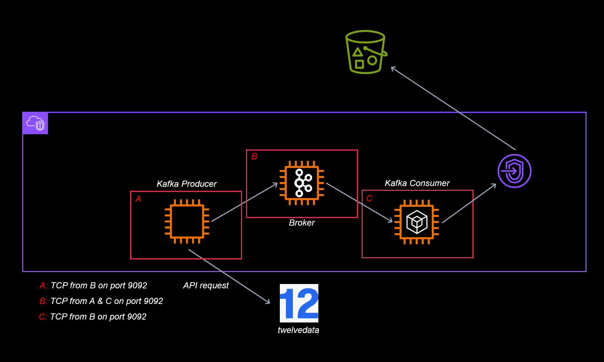

# Real Time Stock Kafka Streaming Pipeline in the Cloud 
In this project, we build a real time data pipeline which streams stock market data from the [Twelve Data](https://twelvedata.com/) API and upload the result to S3. In more detail, the kafka-python package is used to create a kafka producer which sends stock market data to a broker directly from the API. A kafka consumer is then used to consume that data from the broker, and the [AWS SDK for Python](https://aws.amazon.com/sdk-for-python/) is used to push the result to an S3 bucket. To emphasize loose coupling, we deploy the kafka consumer, server, and producer on separate EC2 instances. Since kafka uses TCP protocol on port 9092 to communicate, we open these ports on each instance for inbound traffic from neccesary IPs. A diagram showing the achitecture of this project in detail is shown below. 

## Reproducability
The architecture above can be easily reproduced by using the code found in this repository and folloing the steps outlined below.
### Step 1: Obtaining your Twelve Data API Key
Make a free account with [Twelve Data](https://twelvedata.com/) to obtain access to their API. Follow the signup process, and save your __api_key__ for later use.
### Step 2: Create Instance 1, the Kafka Server
- Create a new EC2 instance named "Kafka Server"
    - Choose Ubuntu OS and t2.small for the size.
    - Allow Port 22 inbound SSH traffic from your IP.
    - Allow Port 9092 inbound TCP traffic from the CIDR range corresponding to the VPC of this instance. 
    - Alternatively to the above step, wait until Steps 3 and 4 are completed, open port 9092 to inbound TCP traffic from the IPs associated with the Producer and Consumer instances.
- SSH into __Kafka Server__ and run `git clone https://github.com/PeoplesJWilson/stock-market-pipeline.git` to clone this repo to your instance.
- Navigate to the __ec2_kafka_server__ folder
- Add execution privileges to the shell files in this directory with the command `chmod +x *.sh`
- Run the setup script with `./ec2_kafka_server_setup.sh`, answering yes when prompted.
- Run `nano ec2_kafka_server_runme.sh` and enter the private IP DNS name for this instance. Configure any other environment variables to your liking.
- Setup the kafka server by running `./ec2_kafka_server_runme.sh`

### Step 3: Create Instance 2, the Consumer
- Create a new EC2 instance named "Consumer".
    - Choose Ubuntu OS and t2.small for the size.
    - Allow Port 22 inbound SSH traffic from your IP.
    - Allow Port 9092 inbound TCP traffic from the CIDR range corresponding to the __single private IPV4 of the Kafka Server instance above__.
    - Add an IAM role allowing S3 write permissions.
- SSH into your newly created instance.
- Run `git clone https://github.com/PeoplesJWilson/stock-market-pipeline.git` to clone this repo to your instance.
- Navigate to the __ec2_consumer__ folder.
- Add execution privileges to the shell files in this directory with the command `chmod +x *.sh`
- Run the setup script with `./ec2_consumer_setup.sh`, answering yes when prompted.
- Run `nano ec2_consumer_runme.sh` and enter the private IP DNS name for the __Kafka Server instance__, as well as your desired bucket name. Configure any other environment variables to your liking, consistent with the previous step.
- Begin consuming from the kafka server by running `./ec2_consumer_runme.sh`

### Step 4: Create Instance 3, the Producer
- Create a new EC2 instance named "Producer".
    - Choose __Amazon Linux__ OS and t2.small for the size.
    - Allow Port 22 inbound SSH traffic from your IP.
    - Allow Port 9092 inbound TCP traffic from the CIDR range corresponding to the __single private IPV4 of the Kafka Server instance above__.
    - Add an IAM role allowing S3 make bucket permissions.
- After the instance is created, SSH into it.
- Install git with `sudo yum install git`
- Run `git clone https://github.com/PeoplesJWilson/stock-market-pipeline.git` to clone this repo to your instance.
- Navigate to the __ec2_producer__ folder.
- Add execution privileges to the shell files in this directory with the command `chmod +x *.sh`
- Run the setup script with `./ec2_producer_setup.sh`, answering yes when prompted.
- Run `nano ec2_producer_runme.sh` and enter your __api_key__ from Twelve Data, the private IP DNS name for the __Kafka Server instance__, and your desired bucket name from the previous step. Configure any other environment variables to your liking.
- begin producing to the kafka server by running `./ec2_producer_runme.sh`

As long as all three instances are running in tandem, real time stock market data will begin uploading to the S3 bucket.

